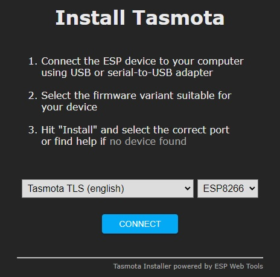

# Frequency measurement
## Principle
The frequency meter consists of two microcontroller boards. A Raspberry Pico Pi and an ESP8266 board. The Pico Pi is responsible for measuring the actual mains frequency. The values read are passed to the ESP8266 using a serial port running a 9600 baus. The ESP8266 is programmed with a TLS version of the TASMOTA firmware. The analogue output of the ZMPT101B module is connected to the ADC0 convertor of te Pico Pi. 

The basic principle of the Mains Frequency meter is detetecting the zero crossings of the Alternate Voltage 50Hz signal.
The Pico Pi determines the rasing zero crossings of the sine wave and counts 50 zero crossings. The time is measured using the internal micro seconds clock. From this measurement the mains frequency is derived. To smooth the output of the frequency measurements, a running average is taken using $freq = &alpha; freq_{meas} + (1-&alpha; ) freq$, with $freq_{meas}$ the raw measured value.

To prevent counting the zero crossing twice every 50Hz period, we only determine the zero crossing when a full period is detected. The 230V AC voltage is transformed down to a AC signal between 0 and 3 V. This signal is fed into the ADC of the Pico Pi. The average value $a_{off}$ is subtracted from the ADC reading. The parameers $a_{min}$ and $a_{max}$ are used to apply a hysteresis to the zero corossing detection. Now the time for detecting 50 periods $t_{50}$ is measured on a micro second scale. This time will be approximately 1 second. This is shown in de graph below


The frequency is cacluated by:

$f = us/(t_{50} / 50)$

The frequency is adjusted by the parameter $us$ which is the number of microsecond counts in 1 second and is approximately $us=1000000$.


## Setting parameters

A number of parameters can be set on the Pico Pi.

| command | explanation |
|---------|-------------|
|get <var_name>	|		gets value of <var_name>|
| set <var_name> <value>  |   sets <var_name> to value <value>|
| readflash		|	reads the stored variables from EEPROM/flash|
| writeflash	|		writes the variables to EEPROM/flash|

 The following parameters are used:


| parameter | explanation |
|-----------|-------------|
| us			|us_factor is the callibrated time of 1s in microseconds, (us = 1000000)|
| a_off		|the offset that is subtracted from the A0 signal (the 0 crossing of the sine wave) (a_off = 500)|
| a_min		|a negative offset to determine the raising edge (a_min = -50)|
| a_max		|a positive offset to determine the raising edge (a_max = 50)|
| alpha		|the smoothing factor in freq_smoothed = freq_smoothed * (1-alpha) + freq * alpha (alpha = 0.40)|
| discard		|The factor used to discard outliers (discard = 1.0005)|
| readflash	|indicates whether variables stored in EEPROM/flash are read at boot (readflash==1)|
| flash_count |	counter indicating the number of times the flash was written, increases automatically with every flashwrite|

These parameters can be read and written in 3 different ways:
1. In the console by writing the following commands:
```
SSerialSend get <parameter>
```
or
```
SSerialSend set <parameter> <value>
```
2. By using MQTT publish command:
```
cmnd/tasmota_<MAC>/SSerialSend
```
and the raw string:
```
get <parameter>
```
or
```
set <parameter> <value>
```
3. Using the HTPP REST API
```
http://192.168.2.100/cm?cmnd=sserialsend%20get%20a_min
```
or
```
http://192.168.2.100/cm?cmnd=sserialsend%20set%20a_min%20-55
```


## Storing parameters in flash memory

The parameters can be adjusted using the commands show eralier. When the unit is rebooted, the parameters will et their default startup values. 

On startup the parameter `readflash` is read from flash. If `readflash` is equal to 1, all the other parameters are read from flash memory. In order to store the current set of parameters in flash memory, issue the follwing commands:
```
set readflash 1
set flash_count 1 (this is only needed when flash memory is used for the first time)
writeflash
```

To check whether the parameters are correctly written to flash, you can reboot the unit (by disconnecting the power supply for a few seconds) and use these commands:
```
readflash
get readflash
get flash_count
```
You should see the the `flash_count` parameter increaded by 1. You can now check the values of the parameters using the `get <parameter>` command.

## Restoring to default values
Using the following commands, you can restore the default parameters at boot (you prevent the unit from reading the parameters from flash):
```
set readflash 0
writeflash
```

## Electronics

### Main design
The frequency meter consists of two microcontroller boards. A Raspberry Pico Pi and an ESP8266 board. The pico pi is responsible for doing the actual frequency measurement. The ESP8266 is programmed with a TLS version of the TASMOTA firmware. The anaolgue output of the ZMPT101B module is connected to the ADC0 convertor of te Pico Pi. The Pico Pi determines the rasing zero crossings of the sine wave and counts 50 zero crossings. The time is measured using the internal micro seconds clock. From this measurement the mains frequency is derived. To smooth the output of the frequency measurements, a running average is taken using $freq = &alpha; freq_{meas} + (1-&alpha; ) freq$, with $freq_{meas}$ the raw measured value. 

The TASMOTA module is configured in Serial bridging mode. This bridges the serial input and putput to MQTT. 


### ZMPT101B
This is a single phase transformer with an additional OPAMP to convert the transformed voltage between 0 and VCC, where VCC is an externally provided voltage. In out case, we use VCC=3.3V. The potentiometer is adjusted such that the output sine wave is well formed and not clipped. Using a small test programm running on Pico Pi, this adjustment can be tested using the Arduino Serial Plotter tool.

```
int store[1000];
int t[1000];
int m;
void setup() {
  Serial.begin(115200);
  m=micros();
  delay(1000);
  for (int i = 0; i < 1000; i++) {
    store[i] = analogRead(A0);// -700;
    t[i]=micros()-m;
    delayMicroseconds(5);
  }
  delay(3000); // wait until USB CDC serial ports is initialized
  for (int i = 0; i < 1000; i++) {
    Serial.print(t[i]);
    Serial.print(",");
    Serial.println(store[i]);
  }

}

void loop() {
}

```


# Firmware
## TASMOTA on ESP8266
The firmware can be installed directly using [this web installer](https://tasmota.github.io/install/). Choose the 'tasmota TLS (English)' firmware for platform 'ESP8266'. 



Connect the Tasmota unit to your computer using a USB cable.
After flashing the firmware (or resseting the configuaration, see next section), the unit will not be connected to a Wifi network. It will act as a Wifi base station with an SSID in this format: `tasmota-<MAC>_<number>. Connect to this Wifi network and configure the unit as follows:
- Connect the Tasmota unit to your computer using a USB cable.
- start an [online serial monitor](https://googlechromelabs.github.io/serial-terminal/) in the browser and connect to the serial port (try to find a serial port with CH340 in its name). Connect at 115200 baud.
- browse to htpp://102.168.4.1
 - select your Wifi network and insert the Wifi password.
- when redirecting to the new IP address in your network fails, you can see the IP address in the serial output in a line like this:
 ```  HTP: Web server active on tasmota-<MAC>-<number> with IP address 192.168.x.x```
- browse to that IP address, or you will be redirected automaticaly.
 
Ser this initial setting, or restore a backup file.
- configuration -> Configure Module -> select `Generic (0)`. Save
- Configuration -> Configure Module -> set `TX GPIO1` to `SerBr Tx` and set `RX GPIO3` to `SerBr Rx`. Save
- Configuration -> Configure MQTT -> Check 'Use TLS' when using TLS, Enter `Host`, `Port`, `User` = mqtt username, `Password` = MQTT password 
- Console -> In `Enter Command`, enter: `SetOption132 1`

 ## hard reset configuration
 
 When you loose connectivitywith your Tasmota unit, you can hard reset its configuration following these steps:
1. Cut power from the device completely for 30 seconds.
2. Power the device on and off six times with intervals lower than 10 seconds and leave it on after seventh time.
3. Fast power cycle device recovery should activate and the device should be reset to firmware defaults.
 
## Raspberry Pi Pico firmware
The firmware can be compiled using the Arduino IDE.

When a new firmware is provided as an UF2 binary file (freq_pico_cmd.ino.rpipico.uf2), the procedure to flash the Pi Pico is as follows:
- open the casing
- do not plug the unit in the Mains Power!
- Connect the Pico Pi with your computer (using an USB-C cable). While keeping the `BOOT` botton on the Pico Pi pressed, briefly press the `RST` button. The Pico Pi is now in bootloader mode and a mass storage device will show up in your computer. Copy the `.UF2` file to the this mass storage device.

## Mosquitto server using docker-compose

Set up a mosquitto server. this is descibed [here](https://medium.com/himinds/mqtt-broker-with-secure-tls-and-docker-compose-708a6f483c92). Generate certs using the script `generate_certs.sh`. Create a direcotry `./config` in the docker directory with a subdirectory `./config/certs`. Put the generated certs and keyfiles in the `./config/certs' folder.

This is the docker compose-compose.yml file:
```
services:
  mosquitto:
    container_name: mosquitto_tls
    image: eclipse-mosquitto:2
    volumes:
      - ./config/:/mosquitto/config/
    ports:
      - 9883:8883

volumes:
  data_mqtt: ~
```

This is the `mosquitto.conf` file
```
port 8883

cafile /mosquitto/config/certs/ca.crt
certfile /mosquitto/config/certs/server.crt
keyfile /mosquitto/config/certs/server.key

allow_anonymous false
require_certificate false
#use_identity_as_username true
tls_version tlsv1.2
password_file /mosquitto/config/mosquitto.passwd
```
