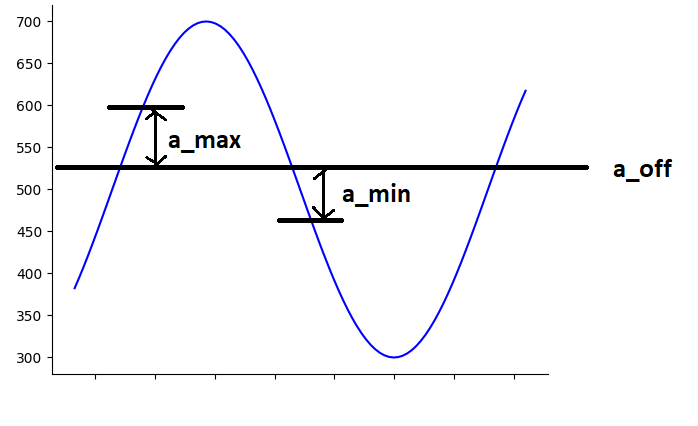
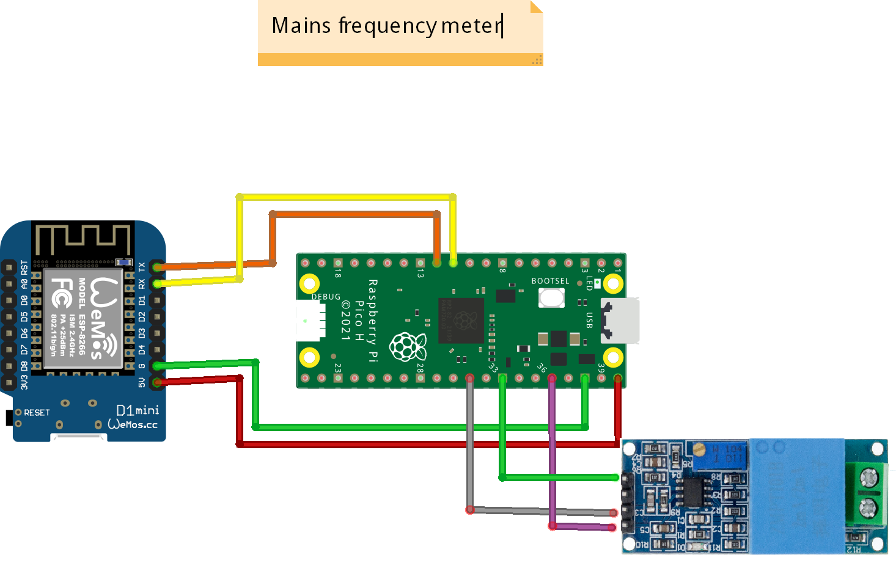

# Frequency measurement
## Principle



## Setting parameters

A number of parameters can be set on the Pico Pi.

| command | explanation |
|---------|-------------|
|get <var_name>	|		gets value of <var_name>|
| set <var_name> <value>  |   sets <var_name> to value <value>|
| readflash		|	reads the stored variables from EEPROM/flash|
| writeflash	|		writes the variables to EEPROM/flash|

 The following parameters are used:


| parameter | explanation |
|-----------|-------------|
| us			|us_factor is the callibrated time of 1s in microseconds, (us = 1000000)|
| a_off		|the offset that is subtracted from the A0 signal (the 0 crossing of the sine wave) (a_off = 500)|
| a_min		|a negative offset to determine the raising edge (a_min = -50)|
| a_max		|a positive offset to determine the raising edge (a_max = 50)|
| alpha		|the smoothing factor in freq_smoothed = freq_smoothed * (1-alpha) + freq * alpha (alpha = 0.40)|
| discard		|The factor used to discard outliers (discard = 1.0005)|
| readflash	|indicates whether variables stored in EEPROM/flash are read at boot (readflash==1)|
| flash_count |	counter indicating the number of times the flash was written, increases automatically with every flashwrite|

These parameters can be read and written in 3 different ways:
1. In the console by writing the following commands:
```
SSerialSend get <parameter>
```
or
```
SSerialSend set <parameter> <value>
```
2. By using MQTT publish command:
```
cmnd/tasmota_<MAC>/SSerialSend
```
and the raw string:
```
get <parameter>
```
or
```
set <parameter> <value>
```
3. 

## Electronics

### Main design
The frequency meter consists of two microcontroller boards. A Raspberry Pico Pi and an ESP8266 board. The pico pi is responsible for doing the actual frequency measurement. The ESP8266 is programmed with a TLS version of the TASMOTA firmware. The anaolgue output of the ZMPT101B module is connected to the ADC0 convertor of te Pico Pi. The Pico Pi determines the rasing zero crossings of the sine wave and counts 50 zero crossings. The time is measured using the internal micro seconds clock. From this measurement the mains frequency is derived. To smooth the output of the frequency measurements, a running average is taken using $freq = &alpha; freq_{meas} + (1-&alpha; ) freq$, with $freq_{meas}$ the raw measured value. 

The TASMOTA module is configured in Serial bridging mode. This bridges the serial input and putput to MQTT. 



### ZMPT101B
This is a single phase transformer with an additional OPAMP to convert the transformed voltage between 0 and VCC, where VCC is an externally provided voltage. In out case, we use VCC=3.3V. The potentiometer is adjusted such that the output sine wave is well formed and not clipped. Using a small test programm running on Pico Pi, this adjustment can be tested using the Arduino Serial Plotter tool.

```
int store[1000];
int t[1000];
int m;
void setup() {
  Serial.begin(115200);
  m=micros();
  delay(1000);
  for (int i = 0; i < 1000; i++) {
    store[i] = analogRead(A0);// -700;
    t[i]=micros()-m;
    delayMicroseconds(5);
  }
  delay(3000); // wait until USB CDC serial ports is initialized
  for (int i = 0; i < 1000; i++) {
    Serial.print(t[i]);
    Serial.print(",");
    Serial.println(store[i]);
  }

}

void loop() {
}

```


## Firmware
### TASMOTA on ESP8266
The firmware can be installed directly using [this web installer](https://tasmota.github.io/install/). Choose as platform

## Mosquitto server using docker-compose

Set up a mosquitto server. this is descibed [here](https://medium.com/himinds/mqtt-broker-with-secure-tls-and-docker-compose-708a6f483c92). Generate certs using the script `generate_certs.sh`. Create a direcotry `./config` in the docker directory with a subdirectory `./config/certs`. Put the generated certs and keyfiles in the `./config/certs' folder.

This is the docker compose-compose.yml file:
```
services:
  mosquitto:
    container_name: mosquitto_tls
    image: eclipse-mosquitto:2
    volumes:
      - ./config/:/mosquitto/config/
    ports:
      - 9883:8883

volumes:
  data_mqtt: ~
```

This is the `mosquitto.conf` file
```
port 8883

cafile /mosquitto/config/certs/ca.crt
certfile /mosquitto/config/certs/server.crt
keyfile /mosquitto/config/certs/server.key

allow_anonymous false
require_certificate false
#use_identity_as_username true
tls_version tlsv1.2
password_file /mosquitto/config/mosquitto.passwd
```
